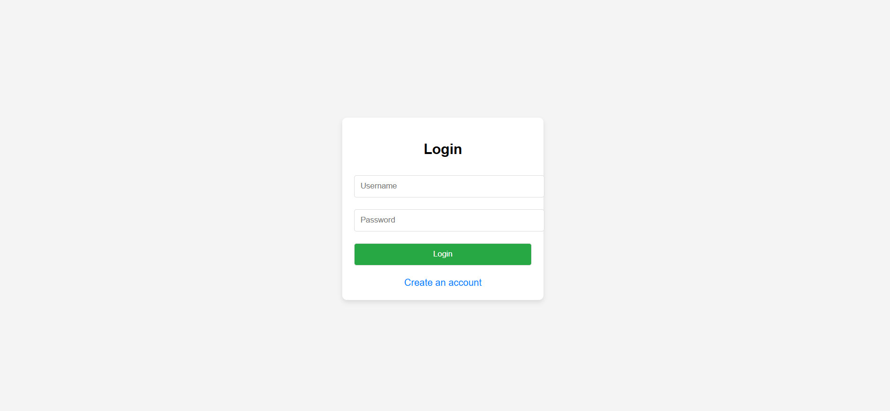
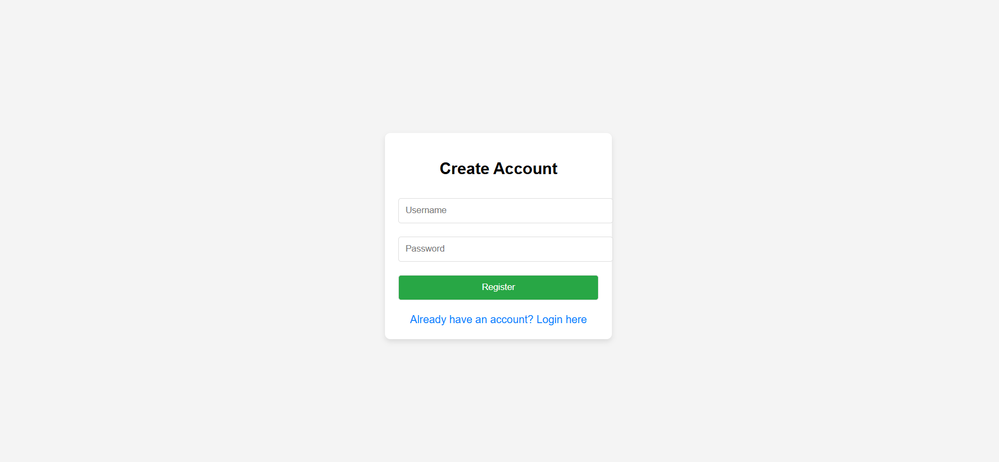

# Tiny URL Shortener with Java Servlets and PostgreSQL (2024)

## Login Page.

## Register Page.

## Demo
[Demo Link](http://yourdemo.link)  <!-- Replace with your actual demo link -->

## Features

- URL shortening service
- User registration and login system
- Session management
- URL redirection
- Secure user sessions
- Logout functionality

## Description

This project is a Tiny URL Shortener built using **Java Servlets** and **PostgreSQL**. Users can register, log in, and shorten URLs, which can then be accessed via unique, shorter links. It includes session management, ensuring that only logged-in users can shorten URLs or view the dashboard.

Developed by **Samir Alam**.

## Technologies Used

- **Java Servlets**: For backend logic and session management.
- **PostgreSQL**: Used as the database for storing user information and URLs.
- **HTML/CSS/JavaScript**: For the frontend UI.
- **Apache Tomcat**: Serves the web application.
  
## Project Structure

